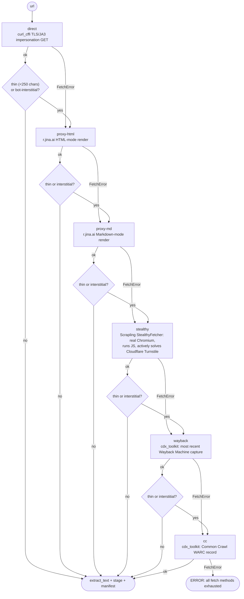

# scripts/htmlstage

Fetch a URL, **stage** the raw content (HTML/Markdown) plus the extracted
text into `artifacts/`, and append a line to `manifest.jsonl` -- so
`verify_citation_grounding.py` can later check whether a quote in
`evidence.jsonl` actually appears on the page it cites.

This is the sibling of `pdf_to_text.py`: same manifest schema, same
`artifacts/` dir, differing only in `"kind": "html"` vs `"pdf"` -- one
grounding-check script can walk both kinds.

`html_to_text.py` deliberately does **not** go through WebFetch (used by
the `deep-research` skill), because WebFetch summarizes the page through a
small model in the same call -- raw content never touches disk, so there's
nothing left to check evidence against later. This script always stages
raw + text first, no summarization.

## Module layout

```
scripts/htmlstage/
    html_to_text.py   CLI entrypoint: run the fetch chain, extract, stage, write manifest
    extract.py         HTML -> text: trafilatura (primary) + stdlib tag-stripper (fallback)
    staging.py          dependency-free primitives: slugify, sha256, resolve_staging, append_manifest
    fetchers/            the 6 fetch methods, see "Fetch chain" below
        __init__.py       re-exports the public API + registry docstring
        base.py            FetchError, _decode(), REGISTRY / @register
        direct.py          fetch_direct  (curl_cffi TLS/JA3 impersonation)
        proxy.py           fetch_proxy_html, fetch_proxy_md  (r.jina.ai)
        stealthy.py        fetch_stealthy  (Scrapling StealthyFetcher, real Chromium)
        archive.py         fetch_wayback, fetch_common_crawl  (cdx_toolkit)
```

`fetchers/` is split by **dependency weight**, not one file per method:
`direct`+`proxy` are lightweight with no heavy deps, `stealthy` pulls in
playwright/patchright/browserforge (imported lazily inside the function),
`archive` shares `cdx_toolkit`. See "Adding a new fetch method" below.

## Fetch chain

`--method auto` (the default) runs all 6 methods in a fixed order,
escalating to the next one whenever the current method **fails outright**,
comes back **thin** (&lt;250 chars, `extract.MIN_REAL_CONTENT_CHARS`), or
extracts to a known **bot-interstitial** banner
(`extract.detect_interstitial` -- Cloudflare/Incapsula/PerimeterX/etc. are
usually HTTP 200 and well over 250 chars of "checking your browser"
boilerplate, so the length check alone wouldn't catch them).



`cc` is the last method in the chain, so it's **never** escalated past --
there's nothing left to try, so even thin content is accepted (thin is
still better than nothing); that's the only method without an escalation
branch.

Chain order (see `html_to_text.py`'s module docstring for the full
rationale):
1. **direct** -- cheapest: curl_cffi impersonates a real browser's TLS/JA3
   fingerprint (not just headers), clearing many WAFs that only check
   headers.
2. **proxy-html** -- r.jina.ai HTML render, for pages where `direct` hits
   bot-protection (Incapsula, ...).
3. **proxy-md** -- r.jina.ai Markdown render, last-resort proxy fallback
   for pages whose HTML-mode render still hits a challenge.
4. **stealthy** -- the heaviest live-fetch method (spins up a real
   Chromium), but the **only** one that can render JS/SPA content or
   actively clear a Cloudflare Turnstile/Interstitial challenge instead of
   just detecting and escalating past it like the three methods above.
5. **wayback** -- once live-fetch is exhausted, try the most recent
   Wayback Machine capture (continuous archiving, one CDX round-trip).
6. **cc** -- Common Crawl, the final fallback (periodic, less complete
   archiving than Wayback, but occasionally has a capture Wayback missed).

Pass `--method <name>` to jump straight to a method already known to work
for that domain, skipping the earlier attempts -- the result is accepted
as-is (just warns if short, no further escalation since forcing a single
method leaves no "chain" to escalate through).

## Usage

```bash
# Auto chain, stage into a product's artifacts (writes manifest.jsonl)
venv/Scripts/python.exe scripts/htmlstage/html_to_text.py <url> \
  --domain bsg --product <product_id>

# Force a specific method (skip the earlier attempts)
venv/Scripts/python.exe scripts/htmlstage/html_to_text.py <url> \
  --method proxy-html --product <product_id>

# No --product/--out-dir -> stages into the shared cache, no manifest written
venv/Scripts/python.exe scripts/htmlstage/html_to_text.py <url> --out-dir <dir>
```

Notable CLI flags:

| Flag | Meaning |
|---|---|
| `--product` | Stage into `<domain>/runs/<product>/artifacts/` + append to the manifest (the same file `pdf_to_text.py` writes to). Preferred. |
| `--out-dir` | Arbitrary staging dir, no manifest written. Mutually exclusive with `--product`. |
| `--method` | `auto` (default) or one of the 6 methods above. |
| `--wayback-timestamp` | Pin a specific Wayback capture (14-digit, from a prior manifest's `wayback_timestamp`) instead of "most recent". |
| `--cc-index` | Pin a specific Common Crawl collection (`cc_index` from a prior manifest). |
| `--browser-ua` | `--method direct` only: switch impersonation target to Safari (some sites specifically block Chrome's TLS signature). |
| `--favor-recall` | Have trafilatura favor more text over precision (the default). |

Exits 0 on success; the last line of stdout is the absolute path to the
`.txt` file.

## Output / staging

```
<domain>/runs/<product_id>/artifacts/
    <slug>.html (or .md if the winning method was proxy-md)   raw content, as-is
    <slug>.txt                                                   extracted text
    manifest.jsonl                                                append-only, shared with pdf_to_text.py
```

Each `manifest.jsonl` entry has `captured_at`, `kind: "html"`,
`fetch_method` (which method won), `extractor` (`trafilatura` /
`html_parser_fallback` / `raw_markdown`), `origin` (the original URL --
always the original URL regardless of which method won, so
`verify_citation_grounding.py`'s origin match keeps working), `slug`, file
paths, `sha256`, `size_bytes`, `chars`, plus fields specific to the
winning method (`wayback_timestamp`, `cc_index`, `via_proxy`,
`via_browser`, `solve_cloudflare`, ...).

## Adding a new fetch method

`fetchers/base.py` exposes `REGISTRY: dict[str, callable]` plus a
`@register("name")` decorator. A method that only needs a URL (no
CLI-specific kwargs) registers itself and gets dispatched by
`html_to_text.py._run_method` via `REGISTRY[method](url)` -- no change
needed to `html_to_text.py`. A method that needs an extra kwarg from the
CLI (like `direct`, `wayback`, `cc`) is wired explicitly in `_run_method`
instead (see `fetchers/__init__.py`'s docstring for why it isn't forced
through the registry).

Adding a new URL-only method:
1. Create a new module in `fetchers/` (or add to an existing one at the
   same dependency weight).
2. Write `fetch_xxx(url: str) -> tuple[bytes, str, dict]`, raising
   `FetchError` on failure, decorated with `@register("xxx")`.
3. Export it from `fetchers/__init__.py`.
4. Add `"xxx"` to `AUTO_CHAIN` in `html_to_text.py`, positioned by cost/
   reliability relative to the other methods.
